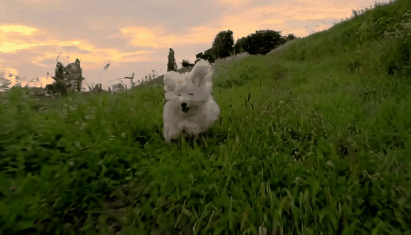

<div align="center">

# Lumos Project

</div>

<b> Lumos Project will release a collection of code bases for frontier generative model research by Alibaba DAMO Academy. </b>

For now, we release:
- [Lumos-1: On Autoregressive Video Generation from a Unified Model Perspective](https://arxiv.org/abs/2507.08801)

### 📰 News

- **[2025-07] 🎉🎉🎉  We release Lumos-1, including its inference, fine-tuning instructions and checkpoints!**


#


<div align="center">


# Lumos-1: On Autoregressive Video Generation from a Unified Model Perspective

<b> A family of autoregressive models, following standard LLM architectures, capable of text-to-image, text-to-video and image-to-video generations. </b>

[](https://arxiv.org/abs/2507.08801)&#160;
[](https://huggingface.co/Alibaba-DAMO-Academy/Lumos-1)


</div>


#### Videos generated by Lumos-1 I2V
<table>
  <tr>
    <td width="300">
      
    </td>
    <td width="300">
      
    </td>
    <td width="300">
      
    </td>
    <td width="300">
      
    </td>
  </tr>
</table>

Note that the mp4 version is placed in `lumos-1/assets/videos`.

#### Videos generated by Lumos-1 T2V
<table>
  <tr>
    <td width="300">
      
    </td>
    <td width="300">
      
    </td>
    <td width="300">
      
    </td>
    <td width="300">
      
    </td>
  </tr>
</table>

Note that the mp4 version is placed in `lumos-1/assets/videos`.

## ⚙️ Lumos-1 Installation

This code builds heavily on [Chameleon](https://github.com/facebookresearch/chameleon) and [Lumina-mGPT](https://github.com/Alpha-VLLM/Lumina-mGPT). Therefore, the installation for Lumos-1 generally follows that of Lumina-mGPT.

Please refer to [INSTALL.md](lumos-1/INSTALL.md) for detailed instructions.

> **Note that before using the Lumos-1 model for training or inference, cd to your lumos-1 path and activate your environment or set your python path in files under `eval/` folder.**:
> ```bash
> cd Lumos-Project/lumos-1/lumos-1
> conda activate lumos-1-public
> ```

## 📽️ Lumos-1 Inference

### Visual Tokenizer Preparation

Lumos-1 depends on discrete visual tokenizers like COSMOS.
In our implementation, we adopted COSMOS-DV4x8x8.
We can download the weights on [COSMOS huggingface projects](https://huggingface.co/nvidia/Cosmos-Tokenizer-DV8x8x8) to local (i.e., Cosmos-Tokenizer-DV4x8x8/) for visual tokenization.
The paths are organized as follows:

```
Lumos_Projects
-lumos-1
    - lumos-1/
        - ckpts/
            - cosmos/
                - tokenizer/
                    - text_tokenizer.json
                - Cosmos-Tokenizer-DV4x8x8/
                    - autoencoder.jit
                    - config.json
                    - decoder.jit
                    - encoder.jit
                    - model_config.yaml
    - xllmx/
- ...
```

### Running on Benchmarks


- **GenEval**: We provide code to generate images in formats that are suitable for GenEval evaluation. For detailed GenEval installation, please refer to their [official repo](https://github.com/djghosh13/geneval). Images can be generated by running the following commands:
    ```bash 
    bash eval/inference_geneval.sh
    ```
    The following code will generate images by running parallelly on `i` number of cards. You can adjust this number according to your own machine.

- **VBench-I2V**: To evaluate on VBench-I2V, we need to download the images from the [Google Drive](https://drive.google.com/drive/folders/1fdOZKQ7HWZtgutCKKA7CMzOhMFUGv4Zx?usp=sharing) and then configure the path in `inference_i2v.py` to reveal your image path:
    ```python
    eval_data_collection = {
        "vbench-i2v-7-4": {
            "video_path": "/YOUR/IMAGE/PATH/vbench-i2v/crop/7-4/",
            "caption_path": "eval/prompts/vbench2_i2v_full_info_qwen32b_vl.json",
        },
    }
    ```
    You can then smoothly run the commands to generate videos in formats that are suitable for VBench-I2V evaluation. 
    ```bash
    bash eval/inference_vbench_i2v.sh
    ```
    For deatiled VBench-I2V installation and evaluation, you can refer to the [VBench repo](https://github.com/Vchitect/VBench/tree/master/vbench2_beta_i2v).


- **VBench-T2V**: We provide code to generate videos in formats that are suitable for VBench-T2V evaluation. Videos can be generated by running the following commands:
    ```bash
    bash eval/inference_vbench_t2v.sh
    ```
    For deatiled VBench-T2V installation and evaluation, you can refer to the [VBench repo](https://github.com/Vchitect/VBench).


### Running on custom T2I / I2V / T2V data
The part below contains instructions for inference with your own data.
> ********************************************************************************************************************
> **Note**: To ensure better performance, you'd better use detailed prompts since we train on long and descriptive prompts.
> ********************************************************************************************************************

- **T2I**: The repo supports custom T2I inference by providing your own detailed text prompts. You can specify the prompts in `inference_t2i.py`, where prompts are given by the dictionary:
    ```python
    eval_data_collection = {
        "custom_t2i": {
            "caption_path": "eval/prompts/custom_t2i_prompts.jsonl",
        },
    }
    ```
    After setting your own prompts, you can run the command to perform inference for customized generation:
    ```bash 
    bash eval/inference_custom_t2i.sh
    ```

- **I2V**: The repo supports custom I2V inference by providing your own image and text prompts. You can specify the information in `inference_i2v.py`, where prompts and the images are given by the dictionary:
    ```python
    eval_data_collection = {
            "custom_i2v_data": {
                "video_path": "eval/custom_i2v_1_frame",
                "caption_path": "eval/prompts/custom_i2v_prompts.json",
            },
        }
    ```
    After setting your own prompts and images, you can run the command to perform inference with them:
    ```bash 
    bash eval/inference_custom_i2v.sh
    ```

- **T2V**: The repo supports custom T2V inference by providing your own text prompts. You can specify the informaiton in `eval/inference_custom_i2v.sh`, where prompts are given by the dictionary:
    ```python
    eval_data_collection = {
        "custom_t2v": {
            "video_path": "",
            "caption_path": "eval/prompts/custom_t2v_prompts.json",
        },
    }
    ```
    After setting your own prompts, you can run the command to perform inference:
    ```bash 
    bash eval/inference_custom_t2v.sh
    ```


## ⛽ Lumos-1 Fine-tuning

### Pre-tokenization
To ensure fast training, we pre-tokenize the data so that the model can directly train on token sequences without the need to tokenize the data online. Note that **this pre-tokenization process support various aspect ratios**, therefore technically, you can use visual data in any common resolution.

- **Step 1**: *CSV file preparation*. Prepare two csv files containing all images/videos used for fine-tuning. We provide two examples placed under `Lumos-Project/lumos-1/lumos-1/pre_tokenize/csv_files`. One csv contains image data and one csv contains video data.

- **Step 2**: *Pre-tokenize data*. We can run the commands for pre-tokenization as:
    ```bash
    bash pre_tokenize/run_tokenization.sh
    ```
    We take image pre-tokenization as an example and show it below. 
    ```bash
    # Step 1: pre-tokenize
    python pre_tokenize/parallel_tokenization_image.py

    # Step 2: obtain data json
    python -u pre_tokenize/concat_record.py  \
    --sub_record_dir  pre_tokenize/data/test_image  \
    --save_path       pre_tokenize/data/test_image/merge-record.json \
    --merge_sub_tasks \
    ```
    When runnning `python pre_tokenize/parallel_tokenization_image.py`, if you want to pre-tokenize the data to 384p, set `--target_size 528` (i.e., (384+672)/2 = 528); if you want to pre-tokenize the data to 256p, set `--target_size 352` (i.e., (256+448)/2 = 352). 

- **Step 3**: *Set config file*. After obtaining the collective json file by runnning `python pre_tokenize/concat_record.py`, we modify the paths in our yaml files placed under `Lumos-Project/lumos-1/lumos-1/configs/data`, which are used for fine-tuning the model.

### Fine-tuning
To fine-tune the model, we can run the corresponding training scripts as:
```bash
# 1B Image generation fine-tuning
bash exps/1B_Stage_1_Image.sh
# Image generation fine-tuning
bash exps/3B_Stage_1_Image.sh
# Image/Video joint fine-tuning
bash exps/1B_Stage_2_JointTraining.sh
# Image/Video joint fine-tuning
bash exps/3B_Stage_2_JointTraining.sh
```

Please remember to:
- download the pre-trained weights and configure the path;
- adjust the batch sizes so that it matches the batch size limit of your specific machine (I set it to 1 by default);
- (Optional) uncomment these lines so that the code can run eval [eval_in_epoch] times in every epoch.
```bash 
--eval_in_epoch 200 \
--eval_mode  text_to_video \
--run_eval \
```


## 🤗 Checkpoints

| Model        | Size | Huggingface                                                                              |
| ------------ | ---- | ---------------------------------------------------------------------------------------- |
| 1B Stage 1 256p   | 1B   | [1B/stage-1-image](https://huggingface.co/Alibaba-DAMO-Academy/Lumos-1/tree/main/1B/stage-1-image)       |
| 1B Stage 2 256p   | 1B   | [1B/stage-2-joint](https://huggingface.co/Alibaba-DAMO-Academy/Lumos-1/tree/main/1B/stage-2-joint)       |
| 1B Stage 2 384p   | 1B   | [1B/stage-2-joint-384p](https://huggingface.co/Alibaba-DAMO-Academy/Lumos-1/tree/main/1B/stage-2-joint-384p) |
| 3B Stage 1 256p   | 3B   | [3B/stage-1-image](https://huggingface.co/Alibaba-DAMO-Academy/Lumos-1/tree/main/3B/stage-1-image)       |
| 3B Stage 2 256p   | 3B   | [3B/stage-2-joint](https://huggingface.co/Alibaba-DAMO-Academy/Lumos-1/tree/main/3B/stage-2-joint)       |
| 3B Stage 2 384p   | 3B   | [3B/stage-2-joint-384p](https://huggingface.co/Alibaba-DAMO-Academy/Lumos-1/tree/main/3B/stage-2-joint-384p) |


## 📄 Citation

```bibtex
@article{Yuan2025Lumos-1,
  title={Lumos-1: On Autoregressive Video Generation from a Unified Model Perspective},
  author={Yuan, Hangjie and Chen, Weihua and Cen, Jun and Yu, Hu and Liang, Jingyun and Chang, Shuning and Lin, Zhihui and Feng, Tao and Liu, Pengwei and Xing, Jiazheng and Luo, Hao and Tang, Jiasheng and Wang, Fan and Yang, Yi},
  journal={arXiv preprint arXiv:2507.08801},
  year={2025}
}
```